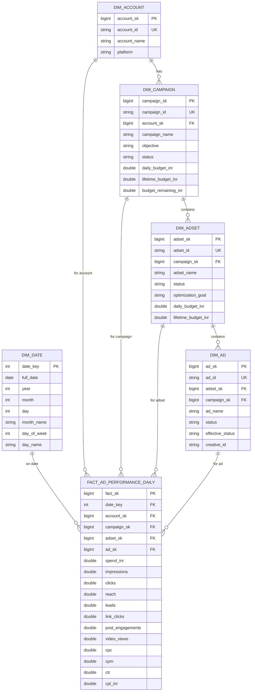

# Meta Ads — Gold Star Schema

## Design

Gold is a classic **star schema** for Meta Ads performance reporting.

| Object | Type | Grain |
|--------|------|-------|
| `gold.dim_date` | Dimension | 1 row / calendar day |
| `gold.dim_account` | Dimension | 1 row / Fabric account |
| `gold.dim_campaign` | Dimension | 1 row / campaign |
| `gold.dim_adset` | Dimension | 1 row / ad set |
| `gold.dim_ad` | Dimension | 1 row / ad |
| `gold.fact_ad_performance_daily` | Fact | 1 row / ad / day |
| `gold.rpt_meta_ad_performance_daily` | Reporting table | Denormalized ad × day (BI-ready) |
| `gold.vw_meta_ad_performance` | SQL view | Star-schema join for SQL endpoint / Warehouse |

## Budget currency rule

Meta budget fields arrive in **paise** (minor units). Convert to **rupees**:

```text
budget_inr = budget_paise / 100
```

Applied in Silver (`*_amount`) and exposed in Gold as `*_inr`. Do **not** divide again when reading Silver amounts.

## Surrogate keys

| Dimension | Surrogate key | Business key |
|-----------|---------------|--------------|
| dim_date | `date_key` (yyyyMMdd int) | `full_date` |
| dim_account | `account_sk` | `account_id` |
| dim_campaign | `campaign_sk` | `campaign_id` |
| dim_adset | `adset_sk` | `adset_id` |
| dim_ad | `ad_sk` | `ad_id` |

Fact `fact_ad_performance_daily` stores FKs: `date_key`, `account_sk`, `campaign_sk`, `adset_sk`, `ad_sk`.

## Entity relationship



## Measures (fact)

| Measure | Source |
|---------|--------|
| `spend_inr` | insight `spend` (already INR) |
| `impressions`, `clicks`, `reach`, `frequency` | insight metrics |
| `leads` | actions where `action_type = 'lead'` (ad grain) |
| `link_clicks` | actions `link_click` |
| `post_engagements` | actions `post_engagement` |
| `video_views` | actions `video_view` |
| `cpl_inr` | `spend_inr / leads` when leads > 0 |

## Reporting table

`rpt_meta_ad_performance_daily` is the single wide table for Power BI / Excel — dimensions denormalized onto the fact grain (no joins required at query time).

## SQL view

`vw_meta_ad_performance` reconstructs the same grain by joining fact → dims (for Lakehouse SQL endpoint / Warehouse consumers who prefer star navigation).

## Referential integrity

Facts require resolved `ad_sk` / `adset_sk` / `campaign_sk` / `account_sk` / `date_key`.
Insight rows whose `ad_id` is missing from `dim_ad` are dropped (logged as unresolved FK count).
Example from sample extract: ad `120247450017800156` appears in insights but not in the ads entity extract (15 daily rows excluded).
